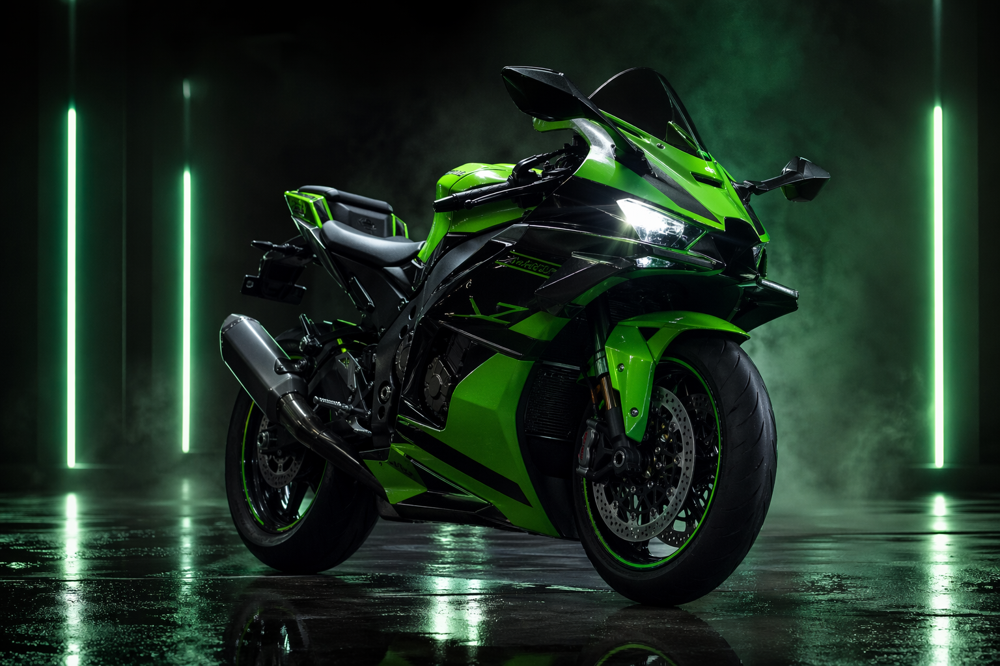
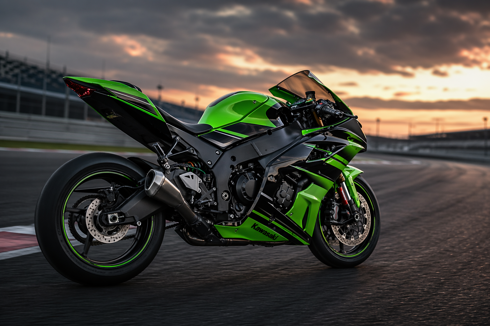

# 🏍️ Kawasaki Ninja ZX-10R | Landing Page

Una landing page moderna y de alto rendimiento inspirada en la **Kawasaki Ninja ZX-10R**, una de las superbikes más icónicas del mercado. Este proyecto combina diseño visual cautivador, animaciones fluidas y una experiencia interactiva inmersiva.

---

## 📋 Características

- ✨ **Animaciones suaves y modernas** - Transiciones fluidas con Intersection Observer
- 🎵 **Audio interactivo** - Botón con sonido del motor rugiendo
- 📱 **Responsive Design** - Optimizado para todos los dispositivos
- 🎨 **Paleta de colores profesional** - Verde lima vibrante sobre fondo oscuro
- ⚡ **Rendimiento optimizado** - Carga rápida y animaciones de 60fps
- 📊 **Contadores animados** - Estadísticas con animación en tiempo real
- 🎬 **Hero visual impactante** - Imagen de la moto con efectos de luces

---

## 🖼️ Vista Previa

### Hero Section


*Sección principal con la imagen de la moto en alta definición y botón interactivo para escuchar el rugido del motor.*

### Track Section


*Sección de pista mostrando el rendimiento y capacidades de la superbike.*

---

## 🎯 Secciones Principales

### 1. **Hero / Inicio** (`#inicio`)
- Título impactante: "Una máquina nacida para perseguir décimas"
- Estadísticas destacadas:
  - 998 cc de motor inline-4
  - 7 títulos WorldSBK destacados por Kawasaki
  - 25% más downforce con nuevos winglets
- **Botón interactivo**: Reproduce el sonido del motor al hacer clic

### 2. **Historia** (`#historia`)
- Timeline de 1953 a la actualidad
- Evolución de Kawasaki como fabricante
- Legado de la línea Ninja

### 3. **Fabricante** (`#fabricante`)
- Información sobre Kawasaki Heavy Industries (fundada en 1878)
- Expansión del grupo: ferrocarriles, energía, aeroespacial
- Filosofía de "Technology corporate group"

### 4. **Tecnología** (`#tecnologia`)
- Especificaciones técnicas:
  - Motor 998 cc inline-4
  - Winglets aerodinámicos
  - Suspensión Showa + Frenos Brembo + Öhlins
  - Electrónica avanzada con IMU

### 5. **Galería** (`#galeria`)
- Imágenes de alta calidad de la moto
- Diseño grid responsive

---

## 🛠️ Stack Tecnológico

- **HTML5** - Estructura semántica
- **CSS3** - Animaciones, gradientes, backdrop-filter
- **JavaScript Vanilla** - Sin dependencias externas
  - Intersection Observer para animaciones
  - Web Audio API para interactividad
  - Contadores animados

---

## 🎮 Interactividad

### Botón de Audio del Motor
Ubicado en la esquina superior derecha de la imagen principal:
- Toca el ícono de volumen
- Escucha el rugido del motor
- Efecto visual de pulso al presionar
- Archivo de audio: `audio/ZX10R.mp3`

### Animaciones de Scroll
- Elementos se revelan suavemente al entrar en viewport
- Contadores animan sus valores
- Navegación suave entre secciones

---

## 📁 Estructura de Archivos

```
landing-moto/
├── index.html          # Estructura HTML
├── styles.css          # Estilos y animaciones
├── script.js           # Lógica JavaScript
├── README.md           # Este archivo
├── assets/
│   ├── zx10r-hero.png      # Imagen principal
│   └── zx10r-track.png     # Imagen de pista
└── audio/
    └── ZX10R.mp3           # Sonido del motor
```

---

## 🚀 Cómo Usar

### Instalación
1. Clona o descarga el repositorio
2. Abre `index.html` en tu navegador

### Navegación
- **Topbar**: Acceso directo a todas las secciones
- **Botones de CTA**: "Ver galería" y "Explorar legado"
- **Scroll suave**: Navega automáticamente entre secciones

### Reproducir Audio
Haz clic en el botón circular con ícono de sonido (esquina superior derecha de la moto) para escuchar el rugido del motor.

---

## 🎨 Paleta de Colores

| Color | Hex | Uso |
|-------|-----|-----|
| Fondo Oscuro | `#050806` | Background principal |
| Verde Lima | `#97ff3f` | Acentos y botones |
| Verde Lima Deep | `#5dd029` | Secundario |
| Amarillo Accent | `#d7ff4d` | Highlights |
| Texto | `#edf5eb` | Tipografía principal |
| Muted | `#9fb29d` | Texto secundario |

---

## 📱 Responsividad

Optimizado para:
- 📱 Móviles (320px+)
- 📱 Tablets (768px+)
- 🖥️ Desktop (1024px+)
- 🖥️ Ultra Wide (1440px+)

---

## ⚡ Optimizaciones

- **Lazy Loading**: Imágenes se cargan solo cuando son visibles
- **CSS Optimizado**: Minificado y sin código muerto
- **JavaScript Vanilla**: Sin librerías externas = más rápido
- **Animaciones GPU**: Usa `transform` y `opacity` para máximo rendimiento
- **Backdrop Filter**: Efectos de vidrio frosted optimizados

---

## 🎬 Animaciones Destacadas

1. **Fade-in de elementos** - Al hacer scroll
2. **Contadores animados** - Números cuentan hacia arriba
3. **Pulse del botón** - Efecto de brillo al presionar
4. **Hover effects** - Interactividad en botones y links
5. **Gradientes animados** - Fondo dinámico

---

## 🌐 Fuentes

- **Orbitron** - Para títulos (700, 800 weight)
- **Rajdhani** - Para cuerpo y UI (400, 500, 600, 700 weight)

Importadas desde Google Fonts con preconnect para máximo rendimiento.

---

## 📊 Especificaciones de la Kawasaki Ninja ZX-10R

| Especificación | Valor |
|---|---|
| Cilindrada | 998 cc |
| Configuración | Inline-4 |
| Potencia | ~203 hp |
| Torque | ~112 Nm |
| Tipo | Superbike |
| Año de Referencia | Generación Actual |

---

## 🔧 Modificaciones Futuras

Posibles mejoras:
- [ ] Agregar más secciones de contenido
- [ ] Integrar formulario de contacto
- [ ] Agregar video de demostración
- [ ] Dark/Light mode toggle
- [ ] Multilingual support

---

## 📝 Notas

- El audio del motor (`ZX10R.mp3`) se reproduce al hacer clic en el botón de sonido
- Todas las animaciones están optimizadas para rendimiento
- El diseño es completamente responsive sin usar frameworks CSS

---

## 👨‍💻 Créditos

Proyecto desarrollado con HTML5, CSS3 y JavaScript Vanilla.

Inspiración: Kawasaki Ninja ZX-10R - La superbike de referencia en el mercado de competición.

---

## 📄 Licencia

Este proyecto es de uso educativo y demostrativo.

---

**¡Disfruta explorando la landing page de la Kawasaki Ninja ZX-10R! 🏍️✨**
